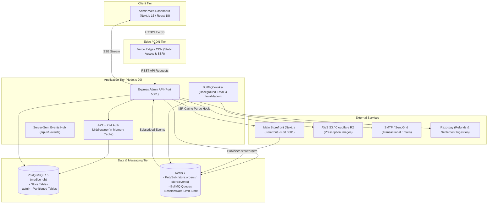

# System Architecture: Pharmico Admin Control Center

## 1. Component Diagram



---

## 2. Stack Choices & Trade-offs

| Layer | Chosen Technology | Rejected Alternative | Rationale for Choice |
|---|---|---|---|
| **Frontend** | Next.js 15 (App Router) | Vite SPA | Server components, native image optimization, fast server-side rendering for administrative tables, standard enterprise ecosystem. |
| **Backend** | Express + TypeScript (Modular Monolith) | NestJS / Microservices | Minimal boilerplate, low ops overhead, fast debugging at 2 a.m., single deployable artifact for all 15 modules. |
| **Database** | PostgreSQL + Prisma ORM | MongoDB / Mongoose | Relational integrity, foreign key cascading, ACID transactions for inventory stock adjustments, strong schema type generation. |
| **Cache / Queue** | Redis (ioredis) + BullMQ | RabbitMQ / Kafka | Multi-purpose tool providing pub/sub, background queues, rate limiting, and cache in a single lightweight server. |
| **Styling** | TailwindCSS + Radix UI | Material UI / Ant Design | Zero runtime CSS-in-JS overhead, modern dark mode/tokens support, unstyled accessible primitives from Radix. |

---

## 3. Monorepo Folder Structure

```
pharmacy-admin/
├── apps/
│   ├── admin-api/                 # Backend REST API server
│   │   ├── src/
│   │   │   ├── config/            # Environment & secrets validation (Zod)
│   │   │   ├── lib/               # Redis, BullMQ, mailer, revalidation helpers
│   │   │   ├── middlewares/       # Auth (JWT/2FA), rate-limiter, errorHandler, logger
│   │   │   ├── modules/           # Feature modules (controller, service, routes, schemas)
│   │   │   │   ├── auth/          # Authentication & 2FA
│   │   │   │   ├── products/      # Catalog & variants
│   │   │   │   ├── inventory/     # Batches & FEFO adjustments
│   │   │   │   ├── orders/        # Order state machine
│   │   │   │   ├── prescriptions/ # Rx verification
│   │   │   │   ├── staff/         # Admin user & role management
│   │   │   │   └── audit/         # Audit log queries
│   │   │   └── app.ts             # Express app setup & route mounting
│   └── admin-web/                 # Next.js 15 Dashboard application
│       ├── src/
│       │   ├── app/               # App Router pages ((auth), (dashboard))
│       │   ├── components/        # Shell (Sidebar, Topbar), shared UI components
│       │   ├── lib/               # api-client, date formatters, currency helpers
│       │   └── store/             # Zustand state management
├── packages/
│   ├── db/                        # Prisma schema, migrations, seeders
│   └── shared/                    # Shared DTOs, Zod schemas, business enums
├── docs/                          # Architecture Decision Records (ADRs) & Playbook docs
└── tests/                         # Vitest unit/integration tests & Playwright E2E
```

---

## 4. Background Job Processing

- **Job Engine**: BullMQ with Redis backend.
- **Queues**:
  1. `email-queue`: Async dispatch of prescription approval/rejection emails, staff invites, low-stock alerts.
  2. `revalidation-queue`: Retries ISR cache purge requests to the main storefront with exponential backoff if the storefront is temporarily down.
  3. `audit-queue`: High-throughput non-blocking writes for compliance logs.

---

## 5. Third-Party Services & Projected Cost at Scale

| Service | Purpose | Launch Cost | 10x Scale Cost |
|---|---|---|---|
| **Vercel** | Frontend Web Hosting | $20/month (Pro) | $40/month |
| **Railway / Render** | Backend API & Worker | $15/month | $50/month |
| **AWS RDS / Supabase** | Managed PostgreSQL | $25/month | $90/month |
| **Upstash / Redis Cloud**| Managed Redis Cache | Free Tier ($0) | $30/month |
| **Cloudflare R2** | Prescription Object Storage | $0 (Free Tier) | $15/month |
| **Resend / SendGrid** | Transactional Emails | $20/month | $80/month |
| **Total** | | **~$80/month** | **~$305/month** |

---

## 6. The 3 Riskiest Architectural Decisions

1. **Shared Database with Storefront**: Both the customer storefront and admin panel share the core `medico_db`. Risk: Schema collisions or lock contention. *Mitigation: Additive `admin_` table partitioning and strict foreign key discipline.*
2. **Synchronous Invalidation (ISR)**: Mutating catalog items triggers an HTTP call to the main site. Risk: Slow admin responses if the main storefront is sluggish. *Mitigation: Fire-and-forget or queue-backed revalidation with a 1.5s timeout.*
3. **In-Memory vs Distributed Session Store**: JWT access tokens are validated in-memory with a 30s cache. Risk: Token revocation delay of up to 30 seconds. *Mitigation: Acceptable SLA for admin panel; immediate token hash revocation in `admin_sessions` table on critical security events.*
