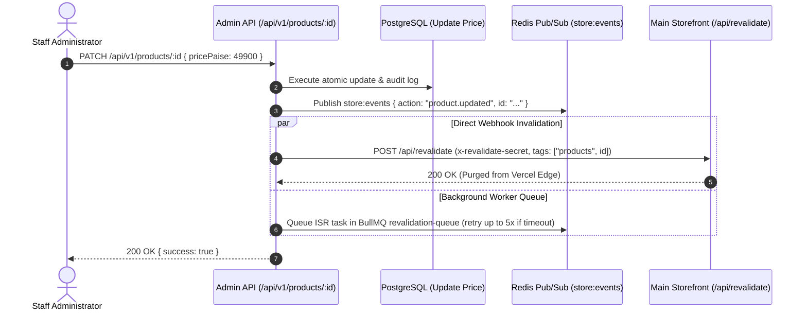

# Caching & CDN Architecture: Pharmico Admin & Storefront Invalidation

## 1. Caching Topology & Multi-Tier Hierarchy

The platform implements a multi-tier caching architecture balancing sub-millisecond read performance with strict consistency:

```
[Browser / Edge] ──> [Next.js App Router (SSR/ISR)] ──> [Node.js In-Memory] ──> [Redis 7] ──> [PostgreSQL 16]
     Tier 1                      Tier 2                      Tier 3             Tier 4            Tier 5
(Static Assets)          (Storefront HTML Cache)        (RBAC / Auth Tokens)   (Dash Stats)     (Source of Truth)
```

---

## 2. Cache Targets, Stores & Expiration Matrix

| Cache Target | Storage Tier | Cache Key Format | TTL | Invalidation Trigger |
|---|---|---|---|---|
| **Static Assets (JS/CSS/Fonts)** | Cloudflare CDN / Vercel Edge | Content-Hashed Filename | 1 Year (`immutable`) | Automatic on new deployment hash |
| **Storefront Product Catalog** | Next.js Storefront ISR | `product:${slug}` | 60 Minutes (stale-while-revalidate) | Immediate webhook purge upon admin catalog mutation |
| **Admin User Auth & Permissions** | Node.js Process Memory | `auth:user:${userId}` | 30 Seconds | Immediate local cache evict on role change / staff update |
| **Admin Dashboard Overview Stats**| Redis Cache-Aside | `admin:dashboard:stats` | 60 Seconds | Auto-invalidated on new order or payment event |
| **Store Settings & Brand Meta** | Redis Cache-Aside | `admin:settings:global` | 10 Minutes | Explicit invalidation upon `PUT /api/v1/settings` |

---

## 3. Instant Cache Invalidation (ISR) Protocol

When an administrator updates a product price, modifies category taxonomy, or publishes a promotional banner, stale caches on the customer storefront must be purged instantly.

### Invalidation Workflow:


### Safety Rules:
1. **Never Cache Authenticated Responses at Edge CDN**: All `/api/v1/*` responses include `Cache-Control: private, no-cache, no-store, must-revalidate`.
2. **Deterministic Cache Bypass**: Append `?fresh=true` or send header `x-bypass-cache: 1` during administrative troubleshooting to query PostgreSQL directly.
