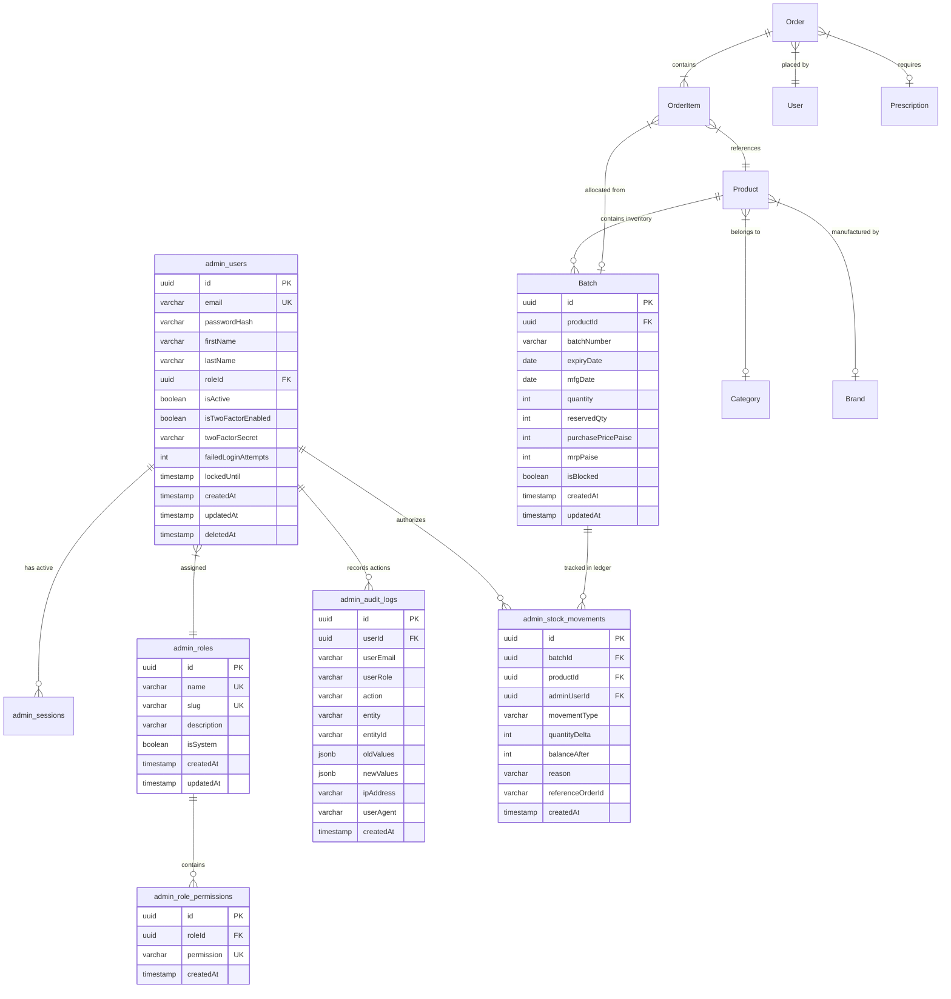

# Database Architecture & Storage: Pharmico Admin Control Center

## 1. Overview & Data Model Design
The data layer utilizes **PostgreSQL 16** accessed via **Prisma ORM** (`packages/db`). The database schema follows an additive partitioning strategy:
1. **Shared Storefront Tables**: Products, Categories, Brands, Customers (`User`), Orders, Order Items, Prescriptions, Appointments, Lab Bookings, Coupons, Banners, Settings.
2. **Dedicated Administrative Tables** (prefixed with `admin_`): Staff credentials, RBAC roles, permissions, active sessions, immutable audit logs, FEFO stock movements, and batch adjustments.

---

## 2. Entity Relationship Diagram (ERD)

---

## 3. Critical Architectural Constraints & Rules

### A. Financial Integrity (Integer Minor Units)
To avoid IEEE 754 floating-point rounding inaccuracies:
- **All monetary fields are stored as integer minor units (paise in INR, cents in USD)**:
  - `pricePaise`: e.g., ₹450.00 is stored as `45000`.
  - `mrpPaise`: e.g., ₹500.00 is stored as `50000`.
  - `discountPaise`: Flat discount in paise.
- Currency conversions occur only at the formatting/UI layer using standard utility functions (`formatCurrency(amountPaise)`).

### B. Soft Deletes (`deletedAt`)
- Sensitive operational entities (`Product`, `Category`, `Brand`, `admin_users`, `Coupon`) implement soft-deletion via an indexed `deletedAt DateTime?` column.
- Queries filter by `deletedAt: null` by default, preventing accidental data loss while preserving historical foreign key integrity for past orders and compliance audits.

### C. Strict Primary & Foreign Key Constraints
- All IDs are standardized as cryptographically random UUIDv4 (`@id @default(uuid())`).
- Foreign keys enforce cascading or protective rules:
  - `admin_role_permissions` -> `CASCADE` on role deletion.
  - `Batch` -> `RESTRICT` on product deletion (cannot delete a product that has existing stock batches).
  - `admin_stock_movements` -> `SET NULL` on admin user deletion (audit records remain intact even if staff member is removed).

---

## 4. Indexing Strategy for Low-Latency Querying

| Table | Index Columns | Index Type | Purpose / Query Optimization |
|---|---|---|---|
| `admin_users` | `email` | UNIQUE B-Tree | O(1) credential lookup during login authentication. |
| `admin_users` | `roleId`, `isActive` | Composite B-Tree | Fast lookup for active staff members by role. |
| `admin_audit_logs` | `entity`, `entityId` | Composite B-Tree | Rapid audit trail inspection for a specific product, order, or user. |
| `admin_audit_logs` | `createdAt DESC` | B-Tree | High-speed paginated retrieval of recent system-wide audit activity. |
| `Batch` | `productId`, `expiryDate ASC` | Composite B-Tree | **Critical for FEFO**: Optimizes instant retrieval of the earliest expiring non-quarantined batch. |
| `Batch` | `isBlocked`, `expiryDate` | Composite B-Tree | Fast quarantine filtering and expiry alert queries. |
| `admin_stock_movements`| `batchId`, `createdAt DESC`| Composite B-Tree | Fast ledger history rendering per batch. |
| `Order` | `status`, `createdAt DESC` | Composite B-Tree | Real-time queue filtering for pending orders and pharmacist review. |
| `Prescription` | `status`, `createdAt ASC` | Composite B-Tree | Pharmacist verification queue ordered by oldest pending upload. |

---

## 5. Prescription File Storage Architecture

- **Engine**: AWS S3 / Cloudflare R2 (S3-compatible Object Storage).
- **Access Model**: Private bucket by default. Zero public access.
- **Upload Flow**:
  1. Client calls `POST /api/v1/prescriptions/upload-url` with file mime type and size.
  2. Server validates file type (`image/jpeg`, `image/png`, `application/pdf`) and max size (10 MB).
  3. Server generates a pre-signed PUT URL with a 5-minute expiration.
  4. Client uploads directly from the browser to the storage bucket.
- **Download / Inspection Flow**:
  1. Pharmacist opens prescription inspection view.
  2. Server verifies `PHARMACIST` or `ADMIN` permission via `can()`.
  3. Server returns a short-lived signed GET URL (valid for 15 minutes).
