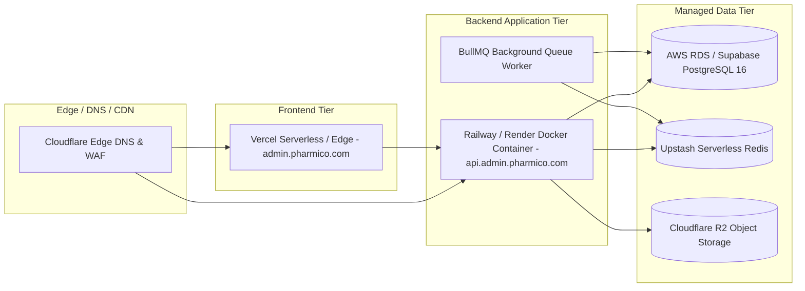

# Hosting Architecture & Cloud Cost Projections

## 1. Production Hosting Topology

The platform separates the administrative frontend from the backend API for maximum security and independent scalability:



---

## 2. Infrastructure Cost Analysis (Launch vs. 10x Scale)

| Component | Launch Provider & Plan | Launch Cost | 10x Scale Provider & Plan | 10x Cost | Scaling Trigger / Changes Required |
|---|---|---|---|---|---|
| **Frontend Dashboard** | Vercel Pro | $20 / mo | Vercel Pro (10 Team Seats) | $40 / mo | Bandwidth & build concurrency. |
| **Backend REST API** | Railway Starter (1 GB RAM, 1 vCPU) | $15 / mo | Railway Pro (4 GB RAM, 4 vCPU autoscale) | $50 / mo | CPU utilization > 70% during peak order ingestion. |
| **Relational Database** | Supabase Pro / RDS db.t4g.micro | $25 / mo | AWS RDS PostgreSQL db.t4g.large (Multi-AZ) | $90 / mo | DB IOPS & disk storage (> 50 GB). |
| **Cache & Queue** | Upstash Redis (Pay-as-you-go) | $0 / mo | Redis Cloud Pro (Dedicated 1 GB) | $30 / mo | Command rate > 10,000 req/min. |
| **Object Storage (Rx)** | Cloudflare R2 (10 GB Free Tier) | $0 / mo | Cloudflare R2 (Standard Storage) | $15 / mo | Total Rx images > 10 GB (zero egress fees). |
| **Transactional Email** | Resend / SendGrid Essentials | $20 / mo | Resend Growth Tier | $80 / mo | Monthly email volume > 50,000. |
| **Total Monthly Spend** | | **~$80 / mo** | | **~$305 / mo** | |

---

## 3. Environment Variable Security & Validation
All required environment variables are strictly validated at startup using Zod in `apps/admin-api/src/config/env.ts`. If any required key is missing or malformed, the process refuses to boot and logs an explicit configuration failure:

```typescript
const envSchema = z.object({
  NODE_ENV: z.enum(['development', 'test', 'production']).default('development'),
  PORT: z.coerce.number().default(5001),
  DATABASE_URL: z.string().url(),
  JWT_ACCESS_SECRET: z.string().min(32),
  JWT_REFRESH_SECRET: z.string().min(32),
  REDIS_URL: z.string().url().optional(),
  MAIN_SITE_URL: z.string().url(),
  REVALIDATE_SECRET: z.string().min(16),
});
```
